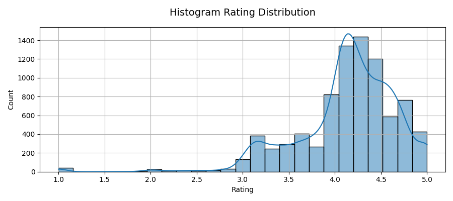
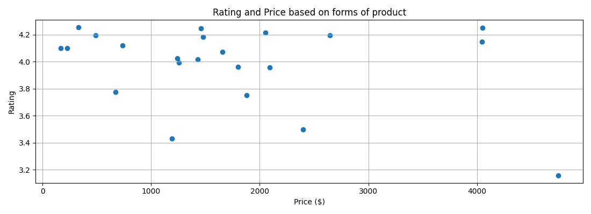
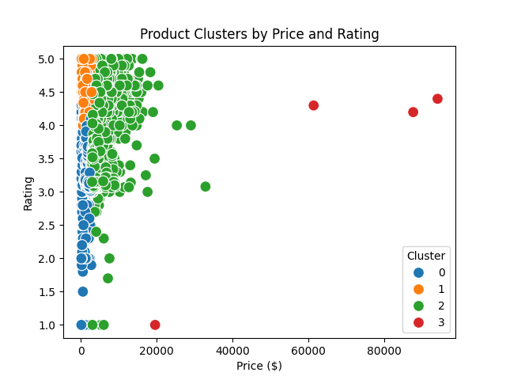
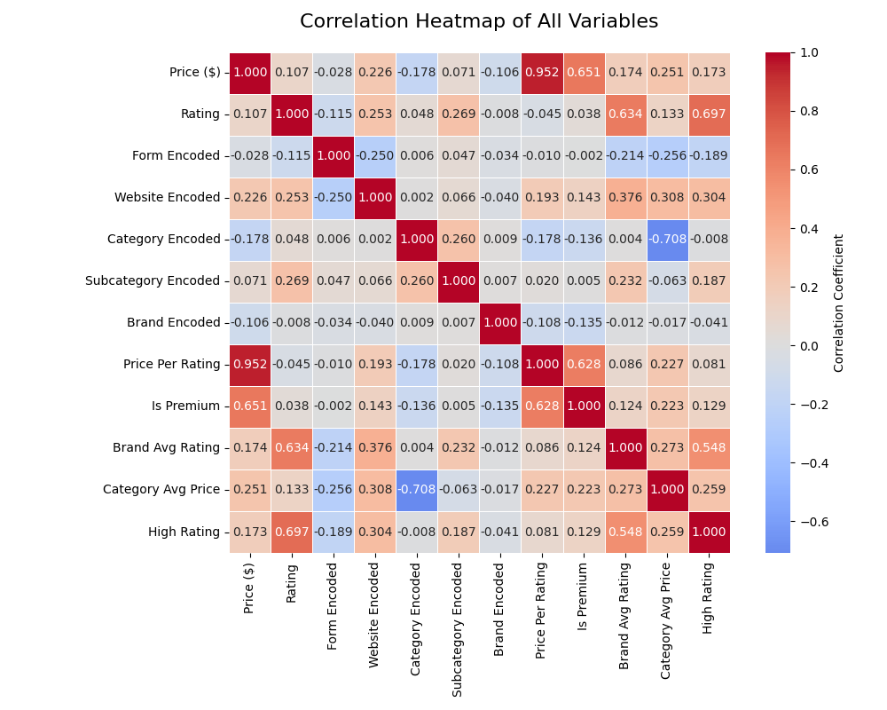
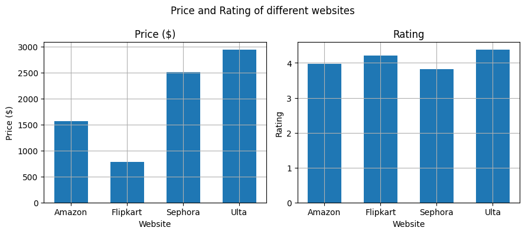
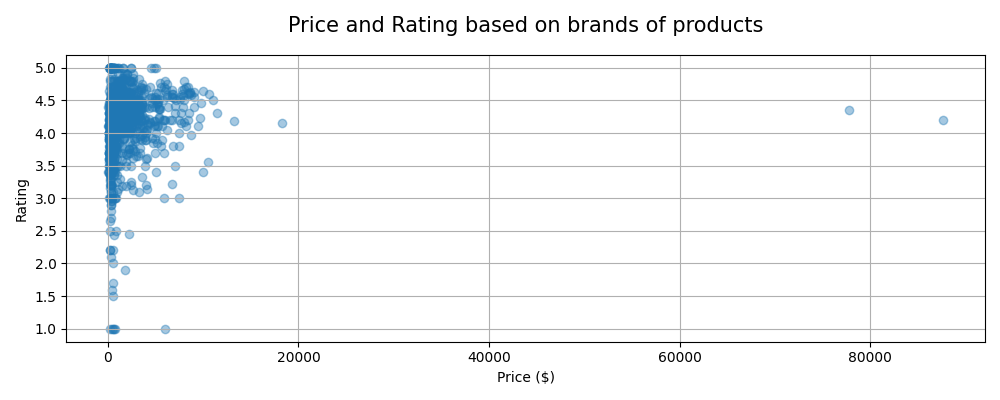

# Beauty Retail Marketing Analysis

A comprehensive data analysis project exploring customer behavior and pricing strategies across major beauty e-commerce platforms.

## Project Overview

This project analyzes **10,322 beauty products** from 1,090+ brands across 4 major e-commerce platforms (Amazon, Flipkart, Sephora, Ulta) to uncover insights about customer preferences, pricing strategies, and rating patterns in the beauty retail industry.

### Business Questions Addressed

- What drives customer satisfaction in beauty products?
- How do pricing strategies vary across platforms and brands?
- Can we predict product ratings based on features like price, brand, and category?
- What market segments exist in the beauty retail space?

## Key Findings

### 1. Price-Rating Paradox
Contrary to common assumptions, **higher prices do not guarantee higher ratings**. Some of the most affordable products (aerosols, foams) achieved excellent ratings, while premium products (serums, creams) showed lower customer satisfaction.

**Impact:** Budget-conscious consumers can find high-quality products without premium pricing.

### 2. Brand Reputation is King
Brand average rating emerged as the **strongest predictor** of individual product ratings (importance score: 0.447), far surpassing price, platform, or product category.

**Insight:** Building brand trust through consistent quality matters more than pricing or platform choice.

### 3. Platform Agnostic Quality
Customer satisfaction is driven by **product quality, not the sales platform**. Products performed similarly across all four platforms when controlling for other factors.

### 4. Market Segmentation
K-means clustering identified **4 distinct market segments**:

| Cluster | Description | Avg Price | Avg Rating |
|---------|-------------|-----------|------------|
| 0 | Premium Products | $5,490 | 4.16 |
| 1 | Best Value | $1,493 | 4.31 |
| 2 | Standard | $1,404 | 4.09 |
| 3 | Budget | $575 | 3.91 |

**Strategy Implication:** The mid-tier segment (Cluster 1) offers the best value proposition.

## Dataset

- **Source:** Multi-platform beauty product data
- **Size:** 10,322 products (8,449 after cleaning)
- **Features:** Brand, price, rating, category, subcategory, product form, website
- **Platforms:** Amazon, Flipkart, Sephora, Ulta
- **Brands:** 1,090 unique brands
- **Product Forms:** 22 types (serum, cream, powder, liquid, etc.)

### Data Quality Measures

- Removed 1,818 products with invalid ratings (outliers > 5.0)
- Standardized 85 brand name duplicates
- Handled missing values and data inconsistencies
- Feature engineering: Created `Price_Per_Rating`, `Is_Premium`, `Brand_Avg_Rating`

## Technical Approach

### Analysis Pipeline

1. **Data Cleaning & Exploration**
   - Outlier detection and removal
   - Brand name standardization
   - Missing value imputation
   - Exploratory data analysis with 12 visualizations

2. **Feature Engineering**
   - Categorical encoding (Label Encoding)
   - Derived features (price ratios, premium flags)
   - Brand-level aggregations

3. **Predictive Modeling**
   - **K-Nearest Neighbors Regression** for rating prediction
     - Hyperparameter tuning via GridSearchCV
     - Test MSE: 0.139
   - **Random Forest** cluster-specific models
     - Per-cluster MSE: 0.034-0.089

4. **Customer Segmentation**
   - **K-Means Clustering** (k=4)
   - Optimal k selection using elbow method
   - Segment profiling by price and rating

### Technologies Used

- **Python 3** - Core programming language
- **Pandas & NumPy** - Data manipulation
- **Scikit-learn** - Machine learning models and preprocessing
- **Matplotlib & Seaborn** - Statistical visualizations
- **Plotly** - Interactive charts
- **Jupyter Notebooks** - Analysis environment

## Project Structure

```
beauty-marketing-analysis-demo/
├── README.md                          # Project overview (this file)
├── notebooks/
│   └── Beauty_Products_Analysis.ipynb # Main analysis notebook
├── data/
│   ├── cleaned_dataset.csv            # Processed data
│   └── data_with_features.csv         # Feature-engineered dataset
├── visualizations/
│   ├── correlation_heatmap.png
│   ├── price_rating_clusters.png
│   ├── rating_distribution.png
│   ├── brand_analysis.png
│   └── ... (8 more visualizations)
└── requirements.txt                   # Python dependencies
```

## Key Visualizations

### Rating Distribution

Most products cluster around 4.0-4.5 stars, showing a right-skewed distribution favoring high ratings.

### Price-Rating Relationship by Product Form

Demonstrates the inverse correlation (-0.31) between price and rating across different product forms.

### Customer Segmentation

Four distinct market segments identified through K-means clustering.

### Feature Correlations

Reveals relationships between price, rating, and categorical variables.

### Platform Comparison

Price and rating patterns across Amazon, Flipkart, Sephora, and Ulta.

### Brand Performance

Analysis of pricing strategies and customer satisfaction across major brands.

## How to Run

### Prerequisites
```bash
python 3.8+
pip install -r requirements.txt
```

### Quick Start
```bash
# Clone the repository
git clone https://github.com/YOUR_USERNAME/beauty-marketing-analysis-demo.git
cd beauty-marketing-analysis-demo

# Install dependencies
pip install -r requirements.txt

# Launch Jupyter Notebook
jupyter notebook notebooks/Beauty_Products_Analysis.ipynb
```

## Model Performance

| Model | Task | Metric | Score |
|-------|------|--------|-------|
| KNN Regressor | Rating Prediction | Test MSE | 0.139 |
| Random Forest (Cluster 0) | Premium Segment | MSE | 0.045 |
| Random Forest (Cluster 1) | Best Value Segment | MSE | 0.038 |
| Random Forest (Cluster 2) | Standard Segment | MSE | 0.034 |
| Random Forest (Cluster 3) | Budget Segment | MSE | 0.089 |

### Feature Importance (KNN Model)
1. **Brand Avg Rating** - 0.447 (Most important)
2. **Website** - 0.164
3. **Price Per Rating** - 0.160
4. **Subcategory** - 0.133
5. **Category** - 0.093

## Business Applications

1. **Pricing Strategy Optimization**
   - Avoid overpricing in categories where customers are price-sensitive
   - Focus on value perception rather than premium positioning

2. **Brand Building**
   - Invest in consistent product quality to build brand reputation
   - Brand trust drives ratings more than individual product features

3. **Product Development**
   - Target the "best value" segment (mid-tier pricing with high ratings)
   - Product form matters: affordable forms can achieve high satisfaction

4. **Marketing Recommendations**
   - Platform choice is less critical than product quality
   - Cross-platform strategies should focus on brand consistency

## Skills Demonstrated

- Data Cleaning & Preprocessing
- Exploratory Data Analysis (EDA)
- Statistical Analysis & Hypothesis Testing
- Feature Engineering
- Machine Learning (Regression, Clustering)
- Model Evaluation & Hyperparameter Tuning
- Data Visualization
- Business Insight Generation

## Future Improvements

- Sentiment analysis on customer reviews
- Time-series analysis for seasonal trends
- Deep learning models for rating prediction
- Recommendation system development
- A/B testing framework for pricing strategies

---

**Note:** This is a portfolio project for educational and demonstration purposes. The dataset is used for analysis learning and does not represent current market conditions.
